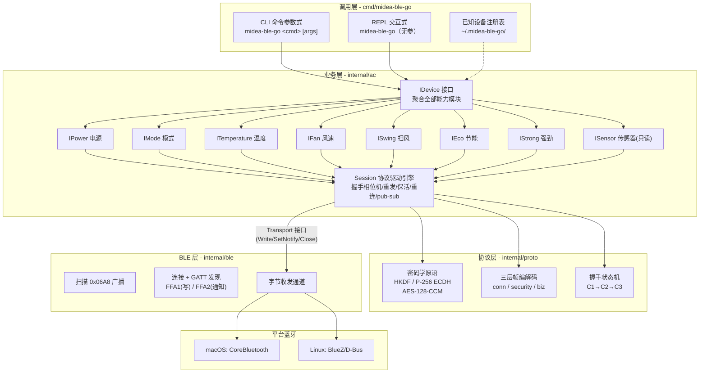
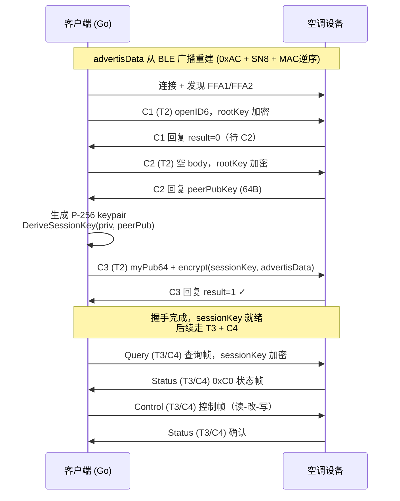

# midea-ble-go 架构设计

> 不经 App、不经云端 —— 从 **Go / macOS** 通过**蓝牙直连**控制你自己的美的 / 华凌空调。

## 目录结构

```
midea-ble-go/
├── cmd/midea-ble-go/          # CLI 调用层（入口 + 命令实现）
│   ├── main.go                #   入口：无参→REPL，有参→单次执行
│   ├── commands.go            #   命令表 + Dispatch 分发（CLI / REPL 共用）
│   ├── repl.go                #   REPL 交互模式：idle / connected 双状态
│   ├── scan.go                #   scan / probe 命令
│   ├── control.go             #   handshake / status / on / off / set 命令
│   ├── connect.go             #   设备打开 + 握手 + 状态打印 辅助函数
│   ├── known.go               #   已知设备注册表（~/.midea-ble-go/known_devices.json）
│   └── cli_test.go            #   CLI 测试
├── internal/
│   ├── ac/                    # 业务层：能力模块 + 设备门面 + 会话引擎
│   │   ├── interfaces.go      #   IDevice + 各模块接口 (IPower/IMode/...)
│   │   ├── device.go          #   bleDevice：聚合全部模块，实现 IDevice
│   │   ├── discovery.go       #   Scan / Open / Probe 门面
│   │   ├── session.go         #   Session 协议驱动引擎（握手/重发/保活/pub-sub）
│   │   ├── transport.go       #   Transport 接口 + Dialer（与 BLE 平台解耦）
│   │   ├── appliance.go       #   美的空调协议常量 + 控制/查询帧构造 + 状态帧解析
│   │   ├── modules.go         #   8 个功能模块实现（电源/模式/温度/风速/扫风/...）
│   │   └── sessiontest/       #   测试夹具：内存空调模拟器
│   │       └── sim.go
│   ├── proto/                 # 协议层·纯算法（设备无关，离线可测）
│   │   ├── frame.go           #   三层帧编解码：conn 层 / security 层 / biz 层
│   │   ├── handshake.go       #   握手状态机：C1→C2→C3 出/入包构造
│   │   ├── crypto.go          #   密码学：HKDF / P-256 ECDH / AES-128-CCM
│   │   └── vectors_test.go    #   离线一致性测试向量（无需真实设备）
│   └── ble/                   # BLE 层·平台传输（唯一引入 tinygo 的包）
│       ├── scanner.go         #   扫描美的 0x06A8 广播 + advertisData 重建
│       └── ble.go             #   连接 + GATT 发现(FFA1/FFA2) + 字节收发
├── mobile/                    # gomobile 适配层：将 internal/ac 导出为 AAR
│   ├── device.go              #   Java-friendly Device 门面
│   └── interfaces.go          #   Transport / Dialer / StateListener 接口
├── docs/
│   ├── architecture.md        # 本文件：架构设计
│   ├── cli.md                 # CLI 用法说明
│   └── protocol.md            # 协议字节级说明
├── build/                     # 构建产物
├── Makefile
├── go.mod
├── go.sum
├── LICENSE
└── README.md
```

Android Compose demo 是独立仓库 `midea-ble-android-demo`。它将生成的
`mobile` AAR 作为依赖，并在 Android 工程内部实现 BluetoothGatt 扫描、连接和
`Transport`；主仓库不再包含 `platform/android` 或 Android app 目录。

## 分层架构

Go 协议主链路采用严格的**四层单向依赖**架构，每层只依赖下一层；`mobile`
位于主链路之外，仅负责把业务门面包装为 Java 可调用的 AAR：



### 各层职责

| 层 | 包路径 | 职责 | 关键类型 |
|---|--------|------|----------|
| **调用层** | `cmd/midea-ble-go/` | 命令行参数解析、REPL 交互、命令分发、已知设备持久化 | `command`, `Dispatch()`, `replSession` |
| **业务层** | `internal/ac/` | 按功能模块暴露 Get/Set/Watch 能力；装配 BLE 扫描/连接 + Session 为 IDevice 门面 | `IDevice`, `IPower`, `IMode`, `Session`, `Transport` |
| **协议层** | `internal/proto/` | 纯算法：三层帧编解码、HKDF/ECDH/AES-CCM 密码学、握手状态机。**零平台依赖，离线可测** | `HandshakeState`, `EncodeConn`, `CipherMsg` |
| **BLE 层** | `internal/ble/` | 调用本机蓝牙执行扫描、连接、收发字节。**唯一引入 tinygo 的包，换平台只改此处** | `Conn`, `Device`, `Scan()` |
| **移动适配层** | `mobile/` | 以 gomobile 兼容的 Java API 包装 `internal/ac`，接收宿主提供的 Transport | `Device`, `Transport`, `Dialer` |

### 关键设计决策

#### 1. Transport 接口解耦 — 协议层可离线测试

`Transport` 接口定义在 `internal/ac/transport.go`，仅包含三个方法：

```go
type Transport interface {
    Write(p []byte) error
    SetNotify(cb func([]byte))
    Close() error
}
```

- **生产实现**：`ble.Conn`（经 tinygo → CoreBluetooth / BlueZ）
- **测试实现**：`sessiontest` 包的内存模拟器

Android 不直接依赖 `internal/ac` 的 Go 包路径，而是使用 `mobile` 生成的 AAR；
BluetoothGatt 实现通过 `mobile.Transport` 注入，因而与协议层保持同一条依赖边界。

协议层（`proto` / `Session`）通过此接口与 BLE 层解耦，**不引入 tinygo**，离线即可跑完整的一致性向量测试。

#### 2. Session 引擎 — 协议驱动的核心

`Session`（`internal/ac/session.go`）是协议驱动的中枢：

- **握手相位机**：C1（预热泵）→ C2（密钥交换）→ C3（会话密钥验证），每阶段独立重发泵
- **业务收发**：设备恒丢第一帧，采用"快速补发 + 耐心等待去抖回复"策略
- **读-改-写控制**：先 Pull 设备状态 → 修改 ACState 缓存 → 下发整帧（避免部分覆盖）
- **保活**：设备主动推送状态，默认不额外查询；显式启用时只发送不等待回复的查询
- **pub-sub**：状态帧到达时广播给所有订阅者（模块的 Watch 通道）

#### 3. 功能模块 — Get / Set / Watch 三向能力

每个功能模块（电源、模式、温度……）统一暴露三个方法：

| 方法 | 方向 | 说明 |
|------|------|------|
| `Get(ctx)` | Pull | 主动查询当前值（有缓存用缓存，无缓存发 Query） |
| `Set(ctx, v)` | Write | 读-改-写：Pull → 修改缓存 → 下发控制帧 |
| `Watch()` | Push | 返回 `<-chan T`，设备主动上报时自动推送（去重、缓冲1） |

`IDevice` 聚合全部 8 个模块 + `Snapshot()` 全量查询 + `SetBeep()` 本地偏好。

#### 4. 协议三层帧结构

```
┌──────────────────────────────────────────────┐
│  conn 层: AA 55 LEN SEQ TYPE body CHK        │  ← 帧边界 + 类型路由
│  ├─ T1: 版本查询（明文）                      │
│  ├─ T2: 握手阶段（rootKey 加密）              │
│  └─ T3: 业务阶段（sessionKey 加密）           │
├──────────────────────────────────────────────┤
│  security 层: CMD SEQ LEN body                │  ← 命令 + 序列号
│  ├─ C1: openID6 上报                          │
│  ├─ C2: 空（触发服务端下发公钥）               │
│  ├─ C3: 客户端公钥 + 加密的 advertisData       │
│  └─ C4: 业务命令                              │
├──────────────────────────────────────────────┤
│  biz 层: TYPE LEN 00 body CHK                 │  ← 业务语义（空调控制/查询/状态）│
│  ├─ 0x40: 控制帧（37 字节）                    │
│  ├─ 0x41: 查询帧（24 字节）                    │
│  └─ 0xC0: 状态帧（设备回复）                   │
└──────────────────────────────────────────────┘
```

#### 5. 握手流程



### 数据流全景

```
用户输入 "midea-ble-go set SN --mode cool --temp 26"
        │
        ▼
  cmd/midea-ble-go         解析参数 → Dispatch("set", ...)
        │
        ▼
  internal/ac               openDevice() → Open(定位+装配Session) → Connect(握手)
        │                              → dev.Mode().Set("cool")
        │                              → dev.Temperature().Set(26)
        │
        ▼
  Session.Control()         读-改-写：Pull 缓存状态 → mutate ACState
        │                    → BuildControlFrame() → doBiz()
        │
        ▼
  proto.HandshakeState      BuildBiz() → EncodeBiz → EncodeSecurity
        │                    → CipherMsg(sessionKey, ...) → EncodeConn(T3, ...)
        │
        ▼
  ble.Conn.Write()          Write-with-response → FFA1 特征
        │
        ▼
  CoreBluetooth / BlueZ     蓝牙 HCI → 空调设备
```

## 关键外部依赖

| 依赖 | 用途 | 所在层 |
|------|------|--------|
| `tinygo.org/x/bluetooth` | BLE 扫描/连接/收发（macOS→CoreBluetooth, Linux→BlueZ） | BLE 层 |
| `golang.org/x/crypto/hkdf` | HKDF-SHA256 密钥派生 | 协议层 |
| `github.com/pion/dtls/v3/.../ccm` | AES-128-CCM 加解密 | 协议层 |
| `crypto/ecdh` (标准库) | P-256 ECDH 密钥协商 | 协议层 |
| `crypto/aes` (标准库) | AES-128 块加密 | 协议层 |
| `github.com/c-bata/go-prompt` | REPL 行编辑 + Tab 补全 | 调用层 |
